# ⚖️ Despacho de Abogados

<div align="center">


**Sistema integral de gestión para despachos de abogados**  
Gestión de citas, clientes, expedientes, y actuaciones judiciales

</div>

---

## 📋 Tabla de Contenidos

- [Documentación Doxygen](#-documentación-del-código-(doxygen))
- [Documentación Técnica y Manual](#-documentación-técnica-y-manual-de-usuario)
- [Descripción](#-descripción-del-proyecto)
- [Características](#-características-principales)
- [Tecnologías](#️-tecnologías-usadas)
- [Arquitectura](#️-arquitectura)
- [Requisitos](#-requisitos-previos)
- [Instalación](#-instalación)
- [Cómo Ejecutar](#️-cómo-ejecutar-la-aplicación)
- [Base de Datos](#️-base-de-datos)
- [Testing](#-testing)
- [Capturas](#-capturas-de-pantalla)
- [Autor](#-autor)
- [Licencia](#-licencia)

---

## 📖 Documentación del Código (Doxygen)

**➡️ [Documentación API Generada por Doxygen](https://htmlpreview.github.io/?https://github.com/fmontesdev/DespachoAbogado_WPF_NetFramework_MVVM/blob/master/docs/html/index.html)**

Documentación técnica completa del código fuente, generada automáticamente con Doxygen. Incluye documentación completa de clases, métodos y propiedades

> **💡 Nota**: La documentación Doxygen se abre en una nueva pestaña mediante [htmlpreview.github.io](https://htmlpreview.github.io/), un servicio que permite visualizar archivos HTML alojados en GitHub. Para un acceso más rápido, acceder a la ubicación de la documentación en el directorio `/docs/html/index.html`


## 📖 Documentación Técnica y Manual de Usuario

**➡️ <a href="https://paco-montes.gitbook.io/despacho-abogado/" target="_blank" rel="noopener noreferrer">Documentación Completa en GitBook</a>**

Accede a la documentación completa del proyecto, incluyendo: documentación técnica, y manual de usuario en formato web interactivo.


## 📖 Mockups de las vistas principales con Figma

**➡️ <a href="[https://paco-montes.gitbook.io/despacho-abogado/](https://www.figma.com/design/JeaA8JNEAdaTzTBalYfUC2/DespachoAbogado?node-id=0-1&m=dev&t=AzycG49jFNySJRz9-1)" target="_blank" rel="noopener noreferrer">Mockups en Figma</a>**

Accede a los mockups (modo edición) de las vistas principales desarrollado en Figma.


## 📖 Descripción del Proyecto

**Despacho de Abogados** es una aplicación de escritorio desarrollada en **WPF** con **.NET Framework 4.8** que implementa el patrón arquitectónico **MVVM** (Model-View-ViewModel). El sistema permite la gestión integral de un despacho de abogados, incluyendo:

- 📅 **Agenda de Citas**: Sistema de reserva de citas con control de horarios disponibles
- 👥 **Gestión de Clientes**: Registro, edición y eliminación de clientes con validaciones completas
- 📁 **Expedientes Judiciales**: Control de casos legales con seguimiento de estado y jurisdicción
- ⚖️ **Actuaciones Judiciales**: Registro y seguimiento de todas las actuaciones procesales
- 📊 **Informes**: Generación de informes con Crystal Reports

El proyecto está diseñado con **separación de responsabilidades** en 5 capas independientes, siguiendo principios **SOLID** y buenas prácticas de desarrollo.

---

## ✨ Características Principales

### 📅 **Agenda de Citas**
- ✅ Gestión de citas con clientes
- ✅ Horarios predefinidos (09:00 a 20:00) en intervalos de 1 hora
- ✅ **Control de disponibilidad**: No permite citas duplicadas en mismo horario
- ✅ Validación de fechas (no permite citas en el pasado)
- ✅ Modalidades: Presencial, Videollamada, Telefónica
- ✅ Estados: Programada, Realizada, Cancelada
- ✅ **Regla de negocio**: No permite eliminar citas realizadas

### 🎯 **Gestión de Clientes**
- ✅ Alta, edición y eliminación de clientes
- ✅ Validación de DNI español (8 dígitos + letra)
- ✅ Validación de email
- ✅ Validación de teléfono móvil español (9 dígitos empezando por 6, 7, 8 o 9)
- ✅ Búsqueda por nombre, apellidos, DNI o población
- ✅ Navegación directa a expedientes del cliente

### 📁 **Gestión de Expedientes**
- ✅ Creación de expedientes vinculados a clientes
- ✅ Código único autogenerado (año + secuencia: ej. 2026/001)
- ✅ Control de jurisdicción (Civil, Penal, Contencioso-administrativo, Social, Mercantil)
- ✅ Estados: Abierto, En trámite, En espera, Archivado, Cerrado
- ✅ Fecha de apertura automática y cierre opcional
- ✅ Navegación directa a actuaciones del expediente

### ⚖️ **Actuaciones Judiciales**
- ✅ Registro de actuaciones por expediente
- ✅ Tipos: Demanda, Escrito, Vista, Sentencia, Recurso, Diligencias, Otro
- ✅ Estados: Pendiente, Completada, Archivada
- ✅ Fecha y hora automática de registro
- ✅ Búsqueda por expediente, cliente o tipo de actuación
- ✅ **Regla de negocio**: No permite crear, editar o eliminar actuaciones en expedientes archivados/cerrados

### 📊 **Sistema de Informes**
- ✅ Agenda de citas con filtros por fecha
- ✅ Expedientes agrupados por estado
- ✅ Actuaciones pendientes por expediente
- ✅ Exportación a PDF con Crystal Reports

---

## 🛠️ Tecnologías Usadas

### **Framework y Lenguaje**
- **.NET Framework 4.8** - Plataforma de desarrollo
- **C# 7.3** - Lenguaje de programación
- **WPF** (Windows Presentation Foundation) - Interfaz de usuario
- **XAML** - Diseño de interfaz declarativo

### **Arquitectura y Patrones**
- **MVVM** (Model-View-ViewModel) - Patrón arquitectónico
- **Repository Pattern** - Abstracción del acceso a datos
- **Command Pattern** - RelayCommand para ICommand
- **Dependency Injection** (manual) - Inyección de servicios

### **Acceso a Datos**
- **Entity Framework 6.5.1** - ORM (Database First)
- **SQL Server** - Base de datos relacional
- **LINQ** - Consultas integradas en el lenguaje

### **Testing**
- **MSTest 3.6.4** - Framework de pruebas unitarias
- **Microsoft.NET.Test.Sdk 17.12.0** - SDK de testing

### **Reporting**
- **Crystal Reports** - Generación de informes
- **DataSets** tipados - Fuente de datos para informes

### **Herramientas**
- **Visual Studio 2022** - IDE de desarrollo
- **SQL Server Management Studio (SSMS)** - Administración de BD
- **Git** - Control de versiones

---

## 🏗️ Arquitectura

El proyecto sigue una **arquitectura en capas** con separación clara de responsabilidades:

```
DespachoAbogado/
│
├── 📊 Model/                          (Capa de Datos)
│   ├── Cliente.cs                     → Entidad Cliente
│   ├── Expediente.cs                  → Entidad Expediente
│   ├── Cita.cs                        → Entidad Cita
│   ├── Actuacion.cs                   → Entidad Actuación
│   ├── DespachoAbogadoModel.edmx     → Entity Framework Model
│   ├── Repositorios/                  → Patrón Repository
│   │   ├── ClienteRepositorio.cs
│   │   ├── ExpedienteRepositorio.cs
│   │   ├── CitaRepositorio.cs
│   │   └── ActuacionRepositorio.cs
│   ├── Mappers/                       → Conversión BD ↔ UI
│   │   ├── EstadoCitaMapper.cs
│   │   ├── TipoActuacionMapper.cs
│   │   ├── JurisdiccionMapper.cs
│   │   └── EstadoExpedienteMapper.cs
│   ├── ModelosPartial/                → Propiedades calculadas
│   │   ├── ClientePartial.cs
│   │   ├── ExpedientePartial.cs
│   │   ├── CitaPartial.cs
│   │   └── ActuacionPartial.cs
│   ├── DataSets/                      → Para Crystal Reports
│   │   ├── dsAgendaCitas.xsd
│   │   ├── dsExpedientesPorEstado.xsd
│   │   └── dsActuacionesPendientes.xsd
│   └── Configuracion/                 → Configuraciones
│       └── HorariosDespacho.cs
│
├── 🎨 View/                           (Capa de Presentación)
│   ├── MainWindow.xaml                → Ventana principal
│   ├── Views/                         → Vistas principales
│   │   ├── ClientesView.xaml
│   │   ├── ExpedientesView.xaml
│   │   ├── CitasView.xaml
│   │   ├── ActuacionesView.xaml
│   │   └── InformesView.xaml
│   └── Windows/                       → Ventanas modales
│       ├── NuevoClienteWindow.xaml
│       ├── NuevoExpedienteWindow.xaml
│       ├── NuevaCitaWindow.xaml
│       └── NuevaActuacionWindow.xaml
│
├── 🧠 ViewModel/                      (Capa de Lógica de Negocio)
│   ├── MainViewModel.cs               → ViewModel principal
│   ├── ClienteViewModel.cs            → Lógica de clientes
│   ├── ExpedienteViewModel.cs         → Lógica de expedientes
│   ├── CitaViewModel.cs               → Lógica de citas
│   ├── ActuacionViewModel.cs          → Lógica de actuaciones
│   ├── InformeViewModel.cs            → Lógica de informes
│   ├── NuevoClienteViewModel.cs       → Lógica ventana modal cliente
│   ├── NuevoExpedienteViewModel.cs    → Lógica ventana modal expediente
│   ├── NuevaCitaViewModel.cs          → Lógica ventana modal cita
│   ├── NuevaActuacionViewModel.cs     → Lógica ventana modal actuación
│   ├── Services/                      → Servicios de negocio
│   │   ├── ClienteService.cs
│   │   ├── ExpedienteService.cs
│   │   ├── CitaService.cs
│   │   ├── ActuacionService.cs
│   │   └── InformeService.cs
│   ├── Validadores/                   → Validaciones de negocio
│   │   ├── ClienteValidador.cs
│   │   ├── ExpedienteValidador.cs
│   │   ├── CitaValidador.cs
│   │   └── ActuacionValidador.cs
│   └── Command/                       → Implementación ICommand
│       └── RelayCommand.cs
│
├── 📄 Reports/                        (Capa de Informes)
│   ├── rptAgendaCitas.rpt            → Informe Crystal Reports
│   ├── rptExpedientesPorEstado.rpt
│   └── rptActuacionesPendientes.rpt
│
└── 🧪 Testing/                        (Capa de Pruebas)
    ├── TestEmailCliente.cs            → Test unitario (validación email)
    ├── TestFechaCita.cs               → Test unitario (validación fecha)
    ├── TestHorarioOcupado.cs          → Test de integración (BD)
    ├── MSTestSettings.cs              → Configuración paralelización
    └── App.config                     → Cadena de conexión para tests
```

### **Flujo de Datos (MVVM)**

```
┌─────────────┐         ┌──────────────┐         ┌──────────────┐
│    VIEW     │◄───────►│  VIEWMODEL   │◄───────►│    MODEL     │
│   (XAML)    │ Binding │ (Lógica UI)  │         │ (Entidades)  │
└─────────────┘         └──────────────┘         └──────────────┘
                               │                         │
                               │                         │
                               ▼                         ▼
                        ┌──────────────┐         ┌──────────────┐
                        │   SERVICES   │◄───────►│ REPOSITORY   │
                        │ (Lógica BLL) │         │ (Acceso BD)  │
                        └──────────────┘         └──────────────┘
                               │                         │
                               │                         │
                               ▼                         ▼
                        ┌──────────────┐         ┌──────────────┐
                        │  VALIDADORES │         │  SQL SERVER  │
                        │ (Reglas BLL) │         │   Database   │
                        └──────────────┘         └──────────────┘
```

---

## ✅ Requisitos Previos

Antes de instalar el proyecto, asegúrate de tener instalado:

| Requisito | Versión Mínima | Notas |
|-----------|---------------|-------|
| **Windows** | 10 o superior | Sistema operativo |
| **Visual Studio** | 2019 o superior | IDE recomendado |
| **.NET Framework** | 4.8 | Runtime requerido |
| **SQL Server** | 2017 o superior | Base de datos (Express es suficiente) |
| **Crystal Reports** | 13.0 o superior | Para generación de informes |

### **Instalación de SQL Server (si no lo tienes)**

```bash
# Descargar SQL Server Express (gratis)
https://www.microsoft.com/es-es/sql-server/sql-server-downloads

# Descargar SQL Server Management Studio (SSMS)
https://aka.ms/ssmsfullsetup
```

---

## 📥 Instalación

### **1. Clonar el Repositorio**

```bash
git clone https://github.com/fmontesdev/DespachoAbogado.git
cd DespachoAbogado
```

### **Paso 2: Configurar la Conexión a la Base de Datos Remota**

> ⚠️ **Importante**: La aplicación se conecta a una base de datos **SQL Server 2022** alojada en un **VPS remoto**. No es necesario instalar SQL Server localmente.

1. **Requisitos de conexión**:
   - La base de datos `CentroDeportivo` ya está configurada en el servidor remoto
   - Se requiere autenticación SQL Server (usuario y contraseña)
   - El firewall del VPS permite conexiones remotas al puerto SQL Server (por defecto 1313)

2. **Configurar la cadena de conexión**:
   - Abre el archivo `App.config`
   - Configura la cadena de conexión con los datos del servidor remoto:

```xml
<connectionStrings>
  <add name="DespachoAbogadoEntities" 
       connectionString="metadata=res://*/DespachoAbogadoModel.csdl|res://*/DespachoAbogadoModel.ssdl|res://*/DespachoAbogadoModel.msl;
       provider=System.Data.SqlClient;
       provider connection string=&quot;
       data source=TU_SERVIDOR;
       initial catalog=DespachoAbogado;
       integrated security=True;
       MultipleActiveResultSets=True;
       App=EntityFramework&quot;" 
       providerName="System.Data.EntityClient" />
</connectionStrings>
```

   **Parámetros de conexión**:
   - `data source`: Dirección IP o dominio del VPS seguido del puerto (ejemplo: `192.168.1.100,1313` o `miservidor.com,1313`)
   - `initial catalog`: Nombre de la base de datos (`CentroDeportivo`)
   - `user id`: Usuario de SQL Server configurado en el VPS
   - `password`: Contraseña del usuario SQL Server
   - `Encrypt=True`: Habilita encriptación SSL/TLS para la conexión
   - `TrustServerCertificate=True`: Permite certificados autofirmados

### **3. Compilar Solución**

```bash
# En Visual Studio
Compilar → Recompilar solución (Ctrl+Shift+B)

# O desde la terminal
msbuild DespachoAbogado.sln /p:Configuration=Release
```

---

## ▶️ Cómo Ejecutar la Aplicación

### **Desde Visual Studio**
1. Abre `DespachoAbogado.sln` en Visual Studio
2. Establece `View` como proyecto de inicio (clic derecho → Establecer como proyecto de inicio)
3. Presiona `F5` o haz clic en **Iniciar depuración**

### **Ejecutable Compilado**
1. Navega a la carpeta de compilación:
   ```
   View/bin/Debug/
   ```
   o
   ```
   View/bin/Release/
   ```
2. Ejecuta `View.exe`

### **Primer Uso**
Al iniciar la aplicación por primera vez:
1. Se abrirá la vista de **Citas** (agenda del día)
2. Puedes navegar entre las secciones usando el menú lateral:
   - 📅 **Citas**: Gestión de agenda
   - 👥 **Clientes**: CRUD de clientes
   - 📁 **Expedientes**: CRUD de expedientes
   - ⚖️ **Actuaciones**: Registro de actuaciones judiciales
   - 📊 **Informes**: Generación de informes

---

## 🗄️ Base de Datos

La aplicación utiliza **Entity Framework 6 Database First**. El modelo de datos se genera automáticamente desde la base de datos `DespachoAbogado`.

### **Esquema de Base de Datos**

#### **Tabla: Cliente**
| Campo | Tipo | Descripción |
|-------|------|-------------|
| `IdCliente` | INT (PK, IDENTITY) | Identificador único |
| `Nombre` | NVARCHAR(50) NOT NULL | Nombre del cliente |
| `Apellidos` | NVARCHAR(100) NOT NULL | Apellidos completos |
| `Dni` | NVARCHAR(9) UNIQUE NOT NULL | DNI (8 dígitos + letra) |
| `Telefono` | NVARCHAR(15) NULL | Teléfono móvil |
| `Email` | NVARCHAR(100) UNIQUE NOT NULL | Correo electrónico |
| `Poblacion` | NVARCHAR(100) NOT NULL | Ciudad/población |
| `Direccion` | NVARCHAR(200) NULL | Dirección completa |

#### **Tabla: Expediente**
| Campo | Tipo | Descripción |
|-------|------|-------------|
| `IdExpediente` | INT (PK, IDENTITY) | Identificador único |
| `Codigo` | NVARCHAR(20) UNIQUE NOT NULL | Código (ej: 2026/001) |
| `IdCliente` | INT (FK) NOT NULL | Referencia al cliente |
| `Titulo` | NVARCHAR(200) NOT NULL | Título del caso |
| `Descripcion` | NVARCHAR(500) NULL | Descripción detallada |
| `Jurisdiccion` | NVARCHAR(50) NOT NULL | Civil/Penal/etc. |
| `Organo` | NVARCHAR(200) NULL | Órgano judicial |
| `Apertura` | DATETIME NOT NULL DEFAULT | Fecha de apertura |
| `Cierre` | DATETIME NULL | Fecha de cierre |
| `Estado` | NVARCHAR(20) NOT NULL | Abierto/Cerrado/etc. |

#### **Tabla: Cita**
| Campo | Tipo | Descripción |
|-------|------|-------------|
| `IdCita` | INT (PK, IDENTITY) | Identificador único |
| `IdCliente` | INT (FK) NOT NULL | Referencia al cliente |
| `Fecha` | DATETIME NOT NULL | Fecha de la cita |
| `Horario` | NVARCHAR(20) NOT NULL | Ej: "09:00-10:00" |
| `Modalidad` | NVARCHAR(20) NOT NULL | Presencial/Videollamada/Telefónica |
| `Motivo` | NVARCHAR(500) NULL | Motivo de la cita |
| `Estado` | NVARCHAR(20) NOT NULL | Programada/Realizada/Cancelada |

**Restricción única**: No se permiten dos citas en el mismo horario y fecha con estado "programada"

#### **Tabla: Actuacion**
| Campo | Tipo | Descripción |
|-------|------|-------------|
| `IdActuacion` | INT (PK, IDENTITY) | Identificador único |
| `IdExpediente` | INT (FK) NOT NULL | Referencia al expediente |
| `Tipo` | NVARCHAR(50) NOT NULL | Demanda/Escrito/Vista/etc. |
| `Descripcion` | NVARCHAR(500) NULL | Descripción de la actuación |
| `FechaHora` | DATETIME NOT NULL DEFAULT | Fecha y hora de registro |
| `Estado` | NVARCHAR(20) NOT NULL | Pendiente/Completada/Archivada |

### **Relaciones**
- **Cliente** 1:N **Expediente** (Un cliente puede tener múltiples expedientes)
- **Cliente** 1:N **Cita** (Un cliente puede tener múltiples citas)
- **Expediente** 1:N **Actuacion** (Un expediente puede tener múltiples actuaciones)

### **Restricciones de Integridad**
- ❌ No se permite eliminar un cliente con expedientes asociados
- ❌ No se permite eliminar un cliente con citas programadas
- ❌ No se permite eliminar un expediente con actuaciones registradas
- ❌ No se permite eliminar una cita con estado "realizada"
- ❌ No se permite crear/editar/eliminar actuaciones en expedientes archivados o cerrados

### **Diagrama Entidad-Relación**

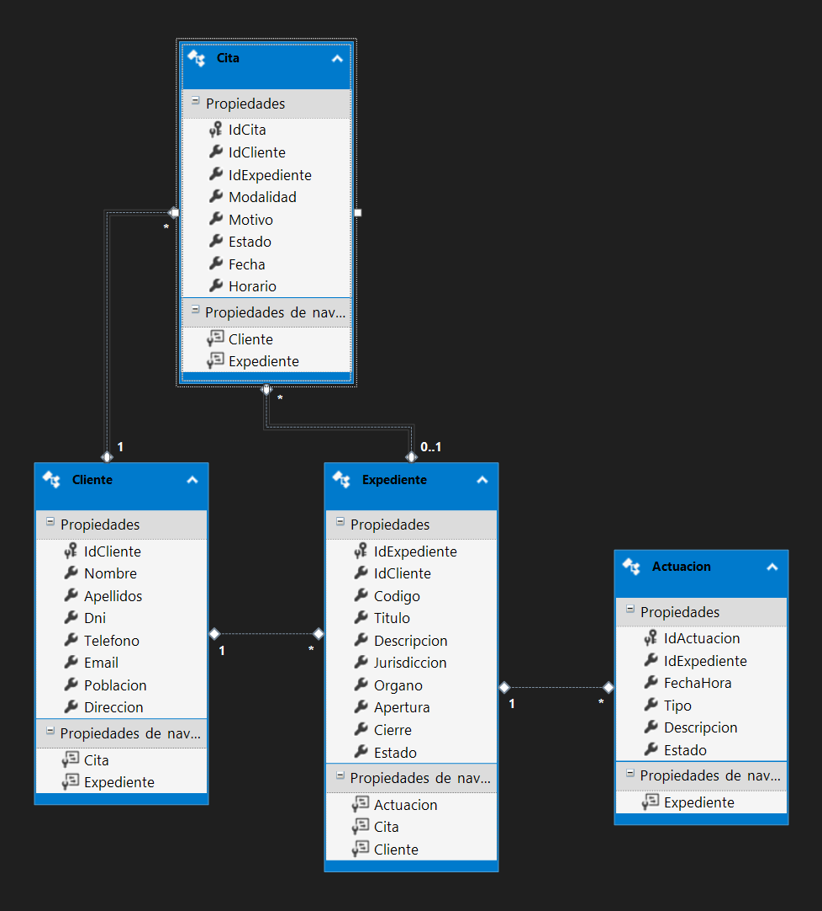

---

## 🧪 Testing

El proyecto incluye pruebas **unitarias** y de **integración** usando **MSTest**.

### **Estructura de Testing**

```
Testing/
├── TestEmailCliente.cs          → Test unitario (validación email)
├── TestFechaCita.cs             → Test unitario (validación fecha)
├── TestHorarioOcupado.cs        → Test de integración (BD)
├── MSTestSettings.cs            → Configuración paralelización
└── App.config                   → Cadena de conexión para tests
```

### **Ejecutar Tests**

#### **Desde Visual Studio**
```bash
Pruebas → Ejecutar todas las pruebas (Ctrl+R, A)
```

#### **Desde la terminal**
```bash
dotnet test Testing/Testing.csproj
```

### **Tests Implementados**

| Test | Tipo | Descripción | Archivo |
|------|------|-------------|---------|
| `TestEmailsValidos_RetornaTrue` | Unitario | Valida emails con formato correcto | TestEmailCliente.cs |
| `TestEmailsInvalidos_RetornaFalse` | Unitario | Rechaza emails con formato incorrecto | TestEmailCliente.cs |
| `TestEmailVacio_RetornaFalse` | Unitario | Rechaza emails vacíos | TestEmailCliente.cs |
| `TestEmailNull_RetornaFalse` | Unitario | Rechaza emails null | TestEmailCliente.cs |
| `TestEmailFormatoIncorrecto_MensajeError` | Unitario | Verifica mensaje de error específico | TestEmailCliente.cs |
| `TestFechasValidas_RetornaTrue` | Unitario | Acepta fechas válidas (hoy y futuras) | TestFechaCita.cs |
| `TestFechasInvalidas_RetornaFalse` | Unitario | Rechaza fechas pasadas | TestFechaCita.cs |
| `TestFechaNull_RetornaFalse` | Unitario | Rechaza fechas null | TestFechaCita.cs |
| `TestFechaAyer_MensajeError` | Unitario | Verifica mensaje de error para fechas pasadas | TestFechaCita.cs |
| `TestFechaHoy_RetornaTrue` | Unitario | Acepta fecha de hoy | TestFechaCita.cs |
| `TestControlHorario_HorarioOcupado_SegundaCitaDenegada` | Integración | Verifica que no se puede crear cita en horario ocupado | TestHorarioOcupado.cs |
| `TestControlHorario_DiferentesHorarios_AmbasCitasCreadas` | Integración | Verifica que se pueden crear citas en horarios diferentes | TestHorarioOcupado.cs |

### **Cobertura de Tests**

- ✅ **Validadores**: `ClienteValidador.ValidarEmail()`, `CitaValidador.ValidarFecha()`
- ✅ **Services**: `CitaService.CrearCitaAsync()`, `CitaService.ObtenerHorariosDisponiblesAsync()`
- ✅ **Reglas de negocio**: Control de horarios ocupados en citas

### **Configuración de Testing**

Los tests de integración requieren acceso a la base de datos. Configura la cadena de conexión en `Testing/App.config`:

```xml
<connectionStrings>
  <add name="DespachoAbogadoEntities" 
       connectionString="..." />
</connectionStrings>
```

---

## 📸 Capturas de Pantalla

### **Ventana Principal - Vista de Citas**
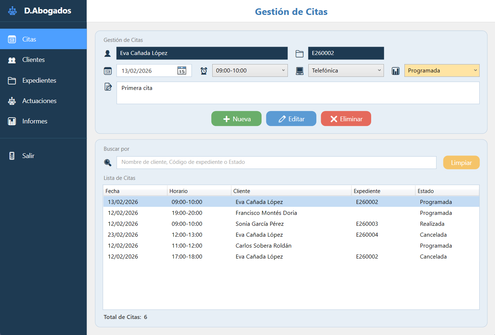

*Gestión de agenda con control de horarios disponibles con búsqueda por cliente, expediente y estado*

### **Ventana de Creación de Nueva Cita**
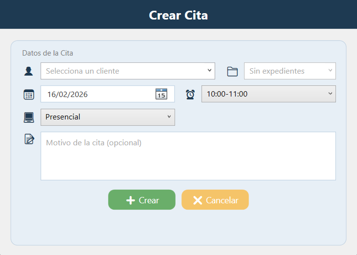

*Ventana modal con ComboBox filtrables para cliente, y expediente y resto de campos necesarios para la creación de la cita*

### **Vista de Clientes**
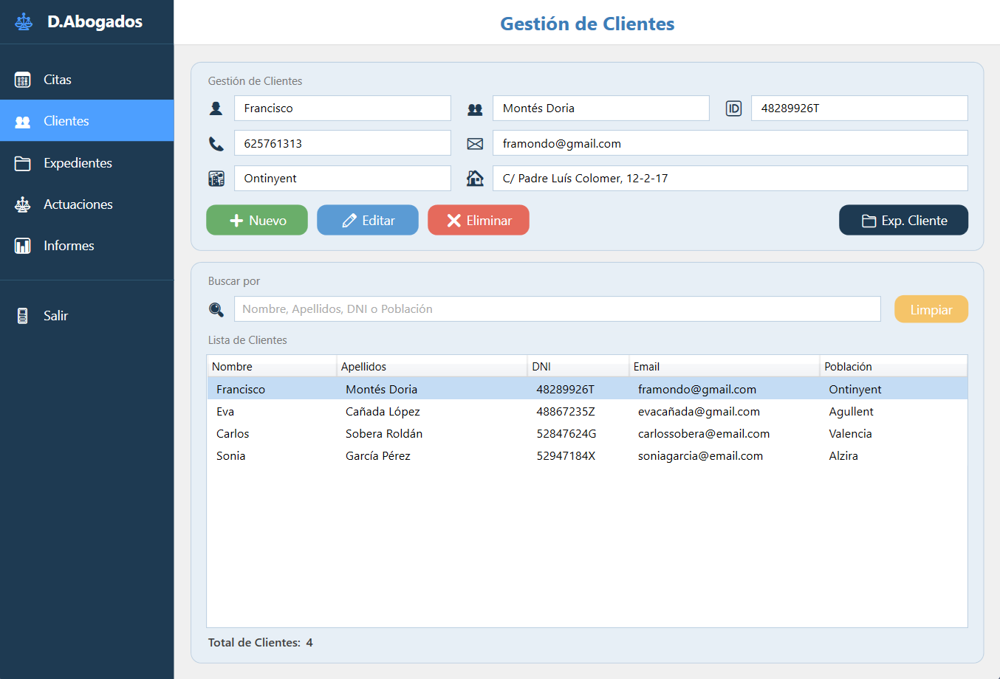

*CRUD de clientes con validaciones completas (DNI, email, teléfono) y búsqueda por nombre, apellidos, DNI y población*

### **Ventana de Creación de Nuevo Cliente**
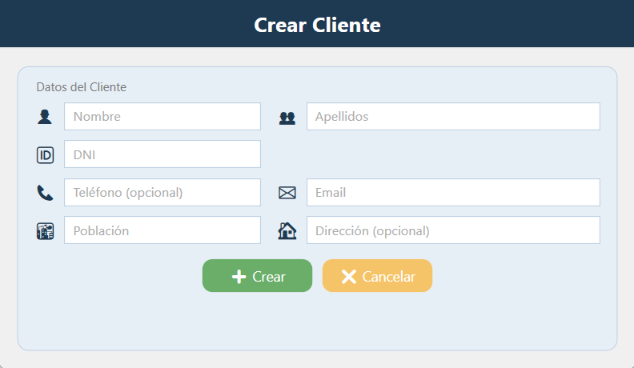

*Ventana modal con formulario para la introducción de los datos del cliente*

### **Vista de Expedientes**
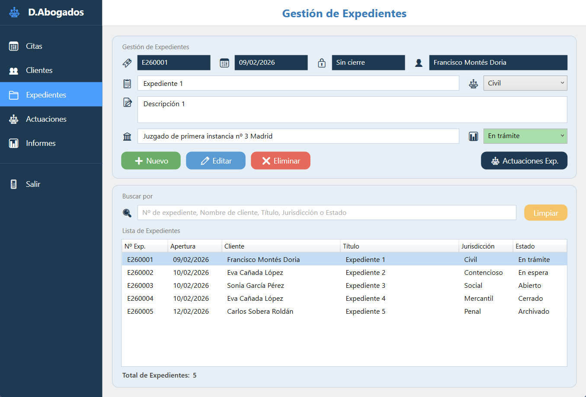

*Gestión de casos legales con búsqueda por expediente, cliente, título del expediente, jurisdicción y estado*

### **Ventana de Creación de Nuevo Expediente**
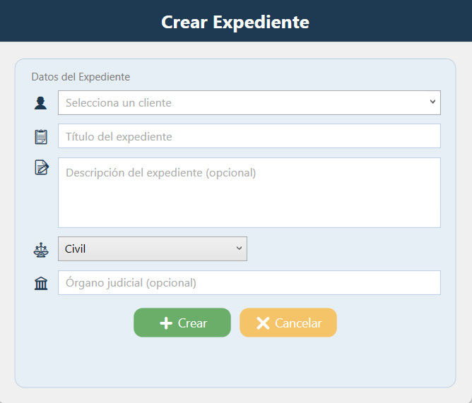

*Ventana modal con ComboBox filtrable para cliente, y resto de campos necesarios para la creación del expediente*

### **Vista de Actuaciones**
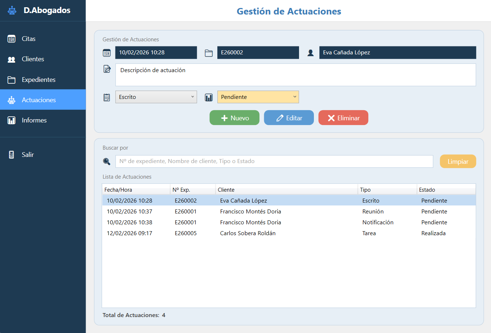

*Registro de actuaciones judiciales por expediente, con búsqueda por expediente, cliente, tipo de actuación y estado*

### **Ventana de Creación de Nueva Actuación**
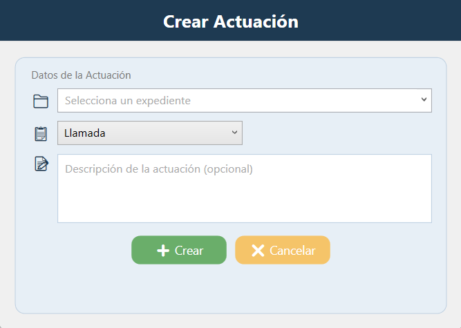

*Ventana modal con ComboBox filtrable para expediente, y resto de campos necesarios para la creación de la actuación*

### **Vista de Informes**
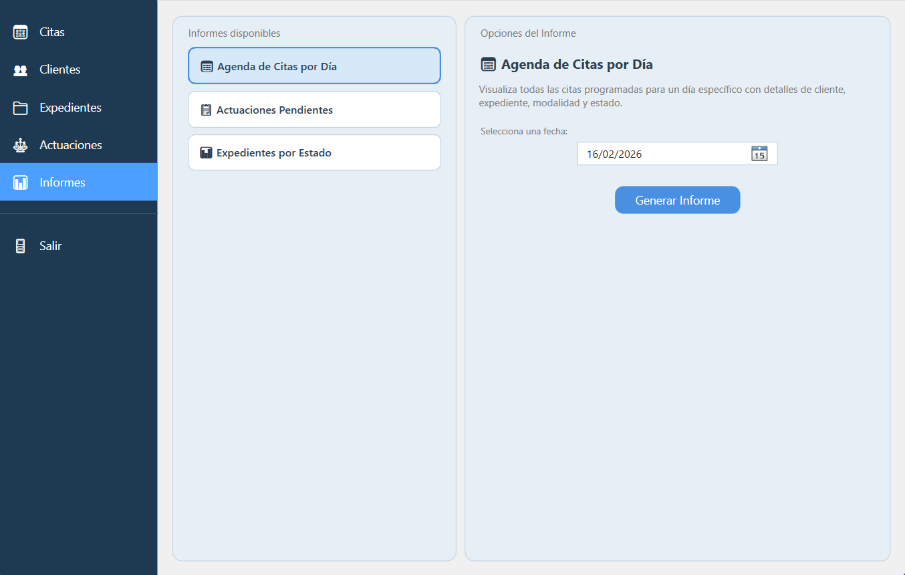

*Generación de informes con Crystal Reports (agenda, expedientes, actuaciones)*

### Informe de Agenda de Citas por Día

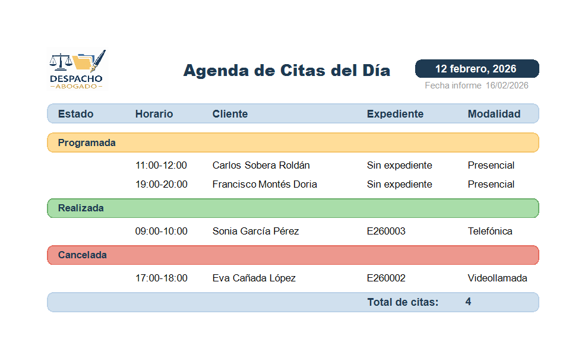

*Informe con las citas del día seleccionado agrupado por estado*

### Informe de Actuaciones Pendientes

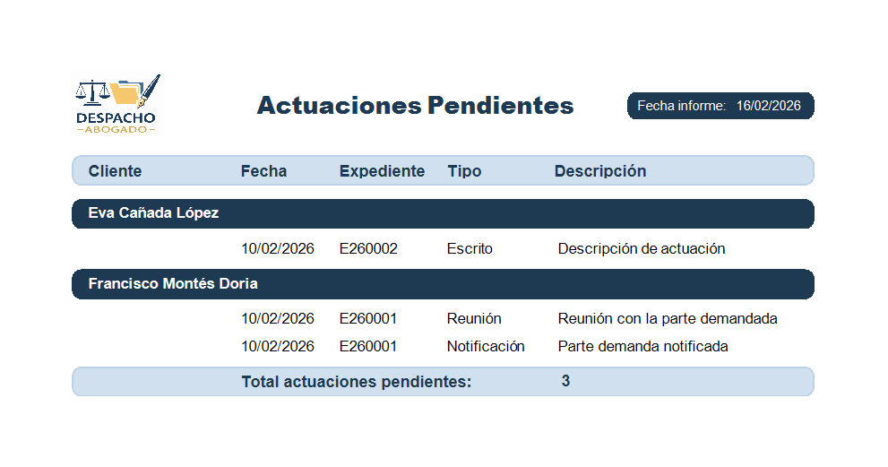

*Informe de actuaciones pendientes agrupadas por cliente*

### Informe de Expedientes por Estado

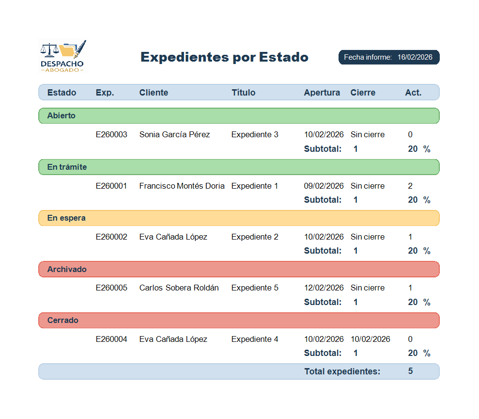

*Informe de expedientes agrupados por estado, con subtotales y porcentajes respecto el total*

> **Nota**: Las capturas de pantalla se encuentran en la carpeta `docs/screenshots/`. Si las imágenes no se visualizan correctamente, asegúrate de tener acceso al repositorio.
---

## 👨‍💻 Autor

<div align="center">

**Francisco Montes**

🔗 **GitHub**: [@fmontesdev](https://github.com/fmontesdev)  
📧 **Email**: [francisco.montes@example.com](mailto:francisco.montes@example.com)  
💼 **LinkedIn**: [Francisco Montes](https://www.linkedin.com/in/franciscomontes)  
🌐 **Portfolio**: [fmontes.dev](https://fmontes.dev)

</div>

---

## 📄 Licencia

Este proyecto está bajo la **Licencia MIT**. Consulta el archivo [LICENSE](LICENSE) para más detalles.

```
MIT License

Copyright (c) 2026 Francisco Montes

Permission is hereby granted, free of charge, to any person obtaining a copy
of this software and associated documentation files (the "Software"), to deal
in the Software without restriction, including without limitation the rights
to use, copy, modify, merge, publish, distribute, sublicense, and/or sell
copies of the Software, and to permit persons to whom the Software is
furnished to do so, subject to the following conditions:

The above copyright notice and this permission notice shall be included in all
copies or substantial portions of the Software.

THE SOFTWARE IS PROVIDED "AS IS", WITHOUT WARRANTY OF ANY KIND, EXPRESS OR
IMPLIED, INCLUDING BUT NOT LIMITED TO THE WARRANTIES OF MERCHANTABILITY,
FITNESS FOR A PARTICULAR PURPOSE AND NONINFRINGEMENT. IN NO EVENT SHALL THE
AUTHORS OR COPYRIGHT HOLDERS BE LIABLE FOR ANY CLAIM, DAMAGES OR OTHER
LIABILITY, WHETHER IN AN ACTION OF CONTRACT, TORT OR OTHERWISE, ARISING FROM,
OUT OF OR IN CONNECTION WITH THE SOFTWARE OR THE USE OR OTHER DEALINGS IN THE
SOFTWARE.
```

---

<div align="center">

[⬆ Volver arriba](#️-despacho-de-abogados---sistema-de-gestión-integral)

</div>
